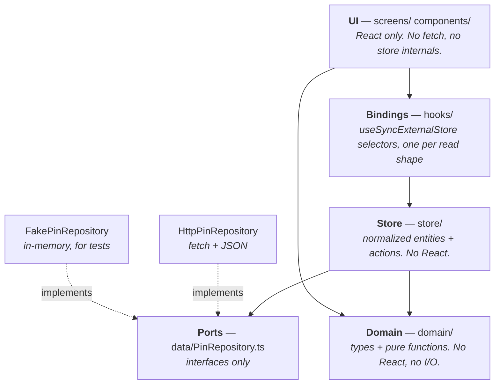
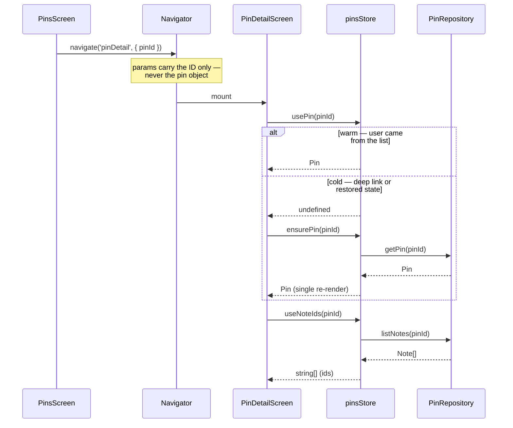
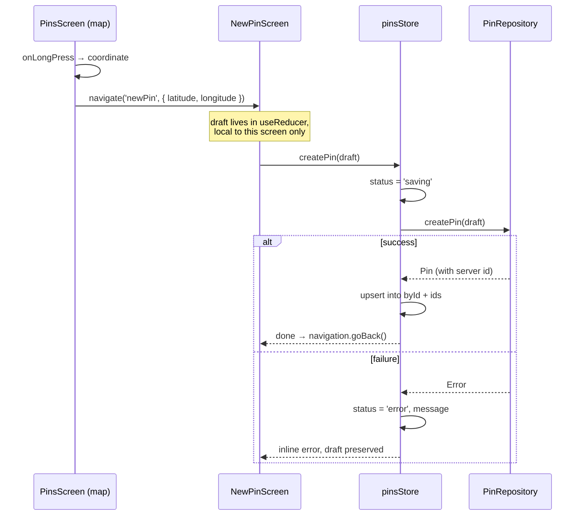
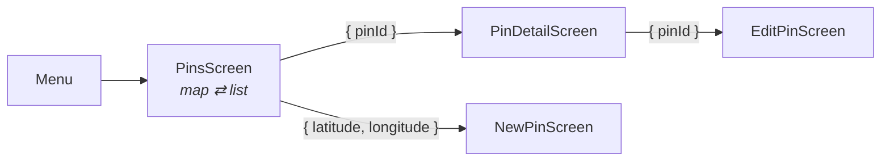

# GeoPin — Architecture

> Status: proposed · Targets React 19.2 / RN 0.86 / Expo SDK 57
> Companion docs: [DECISIONS.md](DECISIONS.md) · [RERENDERS.md](RERENDERS.md) · [ROADMAP.md](ROADMAP.md)

## What the app does

Fetch a list of geotagged pins. Show them on a **map** or in a **list**. Tap one to
see **detail** — an image and a list of notes. Let the user **add** a pin.

Four screens, two data resources, one shared dataset rendered two different ways.
That last property is what drives most of the design: **the map and the list are two
views of one store**, and a pin edit must update both without re-rendering either
wholesale.

---

## The one decision everything else follows from

Name the kinds of state before writing a line of code. Most RN spaghetti comes from
treating all three as one thing.

| Kind | Examples | Owner | Lives in |
|---|---|---|---|
| **Server state** | pins, pin detail, notes, image URLs | the server; we hold a *cache* that can go stale | external store (`store/`) |
| **Client state** | map vs list toggle, draft new-pin form, current map region, filters | the app | `useState` / `useReducer` in the screen, or `useStoredState` if it must persist |
| **Navigation state** | which screen, route params | React Navigation | React Navigation — **never mirrored** |

The failure mode this prevents: putting `selectedPinId` in a global store *and* in
route params, then spending a day on why they disagree. Route params are the source
of truth for "what am I looking at". The store is the source of truth for "what is it".

---

## Layers



**The dependency rule: arrows point inward, never outward.** `domain/` imports
nothing from the app. `store/` imports the repository *interface*, never an
implementation. The UI never imports `store/` internals — only `hooks/`.

That one rule is what makes the app testable without a device, and it's the whole of
Dependency Inversion in practice.

### How the layers map to SOLID

| Principle | Where it shows up here |
|---|---|
| **S**ingle responsibility | A screen renders. A hook subscribes. The store holds truth. A repository talks to the network. Four reasons to change, four places. |
| **O**pen / closed | Adding offline support means a new `CachingPinRepository` that wraps the HTTP one. No store or UI change. |
| **L**iskov | `FakePinRepository` is substitutable for `HttpPinRepository` everywhere, which is what makes the store testable in Node. |
| **I**nterface segregation | `PinRepository` and `NoteRepository` are separate. The map screen never sees note methods. |
| **D**ependency inversion | The store depends on the interface; `App.tsx` injects the implementation. The composition root is the *only* place that knows both. |

---

## Directory structure

```
src/
  domain/
    pin.ts                  Pin, Coordinate, PinDraft + pure helpers (distance, validation)
    note.ts                 Note
    asyncStatus.ts          shared 'idle' | 'loading' | 'ready' | 'error'
  data/
    http.ts                 fetchJson  (from patterns/)
    PinRepository.ts        interface PinRepository        ← port
    NoteRepository.ts       interface NoteRepository       ← port
    HttpPinRepository.ts    implements PinRepository
    HttpNoteRepository.ts   implements NoteRepository
    fakes/
      FakePinRepository.ts  implements PinRepository (in-memory)
      FakeNoteRepository.ts
  store/
    createStore.ts          ~40-line store primitive + useSelector
    entities.ts             EntitySlice<T>, upsert, removeById
    createPinsStore.ts      factory: (PinRepository) => PinsStore
    createNotesStore.ts     factory: (NoteRepository) => NotesStore
  hooks/
    useStores.ts            reads the injected stores off Context
    usePins.ts              usePinIds(), usePin(id), usePinsStatus()
    useNotes.ts             useNoteIds(pinId), useNote(id)
    useCreatePin.ts         action + local saving state
  components/
    PinMarker.tsx           memo'd, subscribes to ONE pin
    PinRow.tsx              memo'd, subscribes to ONE pin
    ViewToggle.tsx
  screens/
    PinsScreen.tsx          map | list, one screen, one toggle
    PinDetailScreen.tsx
    NewPinScreen.tsx
  navigation/
    types.ts                RootStackParamList
  providers/
    AppProviders.tsx        composition root — builds repos + stores, injects them
```

`patterns/` stays where it is. It's a reference library, not app code —
`fetchJson`, `AsyncBoundary`, and `ErrorBoundary` get copied into `src/`, not imported
across that boundary.

---

## The store primitive

Roughly forty lines, no dependencies. This is the entire state-management "framework".

```ts
// store/createStore.ts
export type Store<S> = {
  getState: () => S;
  setState: (updater: (prev: S) => S) => void;
  subscribe: (listener: () => void) => () => void;
};

export const createStore = <S>(initial: S): Store<S> => {
  let state = initial;
  const listeners = new Set<() => void>();
  return {
    getState: () => state,
    setState: (updater) => {
      const next = updater(state);
      if (Object.is(next, state)) return;      // no-op writes don't notify
      state = next;
      listeners.forEach((l) => l());
    },
    subscribe: (listener) => {
      listeners.add(listener);
      return () => void listeners.delete(listener);
    },
  };
};

export const useSelector = <S, R>(store: Store<S>, selector: (s: S) => R): R =>
  useSyncExternalStore(store.subscribe, () => selector(store.getState()));
```

**The one rule that keeps this safe**: a selector must return a *referentially stable*
value when nothing changed. `(s) => s.pins.byId[id]` is fine. `(s) => s.ids.map(...)`
is not — it builds a new array per call and React throws *"getSnapshot should be
cached"*. Derived arrays get computed once inside `setState` and stored. See
[RERENDERS.md](RERENDERS.md).

### Normalized entity shape

```ts
export type EntitySlice<T> = {
  byId: Record<string, T>;
  ids: string[];           // preserves server order; the list and map render from this
};
```

O(1) lookup by ID — which is exactly what an ID-only navigation param needs — and one
copy of each record, so an edit is correct everywhere at once.

---

## Data flow: opening a pin's detail



The `else` branch is the part most designs forget. Passing IDs instead of objects is
correct, but it means **the detail screen must work with an empty store** — deep link,
notification tap, or React Navigation restoring persisted state on a cold start.
`ensurePin` makes the screen independently addressable. Without it, deep linking is
broken and nobody notices until QA.

## Data flow: adding a pin



The draft never enters the global store. It's local screen state until it's real —
that's what keeps "add a pin" from leaking half-built objects into the map.

---

## Navigation



```ts
export type RootStackParamList = {
  Menu: undefined;
  pins: undefined;
  pinDetail: { pinId: string };
  newPin: { latitude: number; longitude: number };
  editPin: { pinId: string };
};
```

**Params are primitives only.** React Navigation serializes params for deep linking
and state persistence; passing a whole `Pin` triggers a non-serializable warning and
breaks both. Pass the ID, read the pin from the store.

---

## Composition root

One file knows how everything is wired. Everything else receives what it needs.

```tsx
// providers/AppProviders.tsx
export const AppProviders = ({ children, repositories = productionRepositories }) => {
  // Stable for the app's lifetime → this Context never causes a re-render.
  const stores = useMemo(() => ({
    pins: createPinsStore(repositories.pin),
    notes: createNotesStore(repositories.note),
  }), [repositories]);

  return <StoresContext.Provider value={stores}>{children}</StoresContext.Provider>;
};
```

Tests and Storybook pass `repositories={fakeRepositories}` and get the whole app with
no network. That's the payoff of the ports-and-adapters layering, and it's the
concrete answer to *"testable without a device"*.

---

## Where each React API earns its place

| Concern | API | Why this one |
|---|---|---|
| Pin & note data | `useSyncExternalStore` via `useSelector` | Per-entity subscriptions. A marker re-renders only when *its* pin changes. |
| Injecting stores & repositories | `createContext` + `useContext` | The value is stable forever, so Context costs nothing. This is DI, not state. |
| Draft forms, toggles, transient UI | `useState` / `useReducer` | Local, dies with the screen, which is correct. |
| Map region while panning | `useRef` + `onRegionChangeComplete` | Region fires continuously; state here re-renders every frame. |
| Persisted UI prefs (last view mode) | `useStoredState` | Already built, storage injected. |
| Screen-focus refresh | `useFocusEffect` | Screens stay mounted in a stack; `useEffect` with `[]` won't re-run. |
| Heavy screen splitting | `lazy` + `Suspense` | `react-native-maps` is expensive to evaluate at startup. |
| Render errors | `ErrorBoundary` | Per-screen, so one bad screen doesn't blank the app. |
| Async data fetching | `Suspense` + `use` | **Not yet — see [ADR-007](DECISIONS.md#adr-007-suspense-for-code-splitting-only-not-for-data).** |

---

## What is deliberately out of scope for v1

Offline write queue, background sync, image upload, pin clustering, search, and
optimistic creation. Each has a named seam it can arrive through — a decorator
repository, a store action — so none of them requires a rewrite. See
[ROADMAP.md](ROADMAP.md#post-v1-seams).
