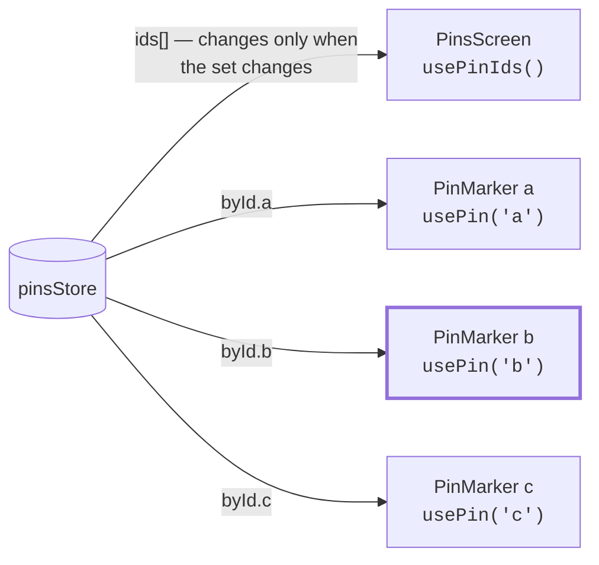

# Architecture Decision Records

Each record: the question, the call, why, and what we gave up. A decision you can't
argue against isn't a decision — so every one names the alternative it beat.

| # | Decision | Status |
|---|---|---|
| [001](#adr-001-name-the-three-kinds-of-state) | Name the three kinds of state | Accepted |
| [002](#adr-002-context-for-dependencies-external-store-for-data) | Context for dependencies, external store for data | Accepted |
| [003](#adr-003-normalize-entities-by-id) | Normalize entities by ID | Accepted |
| [004](#adr-004-usesyncexternalstore-over-context-for-pin-data) | `useSyncExternalStore` over Context for pin data | Accepted |
| [005](#adr-005-repository-interfaces-with-injected-implementations) | Repository interfaces with injected implementations | Accepted |
| [006](#adr-006-navigation-carries-ids-screens-resolve-them) | Navigation carries IDs; screens resolve them | Accepted |
| [007](#adr-007-suspense-for-code-splitting-only-not-for-data) | Suspense for code splitting only, not for data | Accepted |
| [008](#adr-008-map-and-list-are-one-screen-with-a-toggle) | Map and list are one screen with a toggle | Accepted |
| [009](#adr-009-map-region-lives-in-a-ref-not-state) | Map region lives in a ref, not state | Accepted |
| [010](#adr-010-pin-creation-is-pessimistic-in-v1) | Pin creation is pessimistic in v1 | Accepted |
| [011](#adr-011-hand-rolled-store-now-tanstack-query-at-a-named-trigger) | Hand-rolled store now, TanStack Query at a named trigger | Accepted |
| [012](#adr-012-notes-are-a-separate-slice-and-a-separate-repository) | Notes are a separate slice and repository | Accepted |
| [013](#adr-013-development-builds-with-continuous-native-generation) | Development builds with Continuous Native Generation | Accepted |

---

## ADR-001: Name the three kinds of state

**Question.** Where does state go?

**Decision.** Classify every piece of state as **server**, **client**, or
**navigation** before choosing a mechanism. Server state goes in the external store.
Client state goes in `useState`/`useReducer` local to a screen, or `useStoredState`
if it must survive a restart. Navigation state belongs to React Navigation and is
never mirrored anywhere else.

**Why.** The taxonomy, not the library, is what prevents spaghetti. Server state has
properties client state doesn't — it can be stale, it can be refetched, it's shared
across screens, and it isn't ours. Treating a fetched pin like a checkbox value is
how apps end up with four copies of the same record disagreeing with each other.

**Gave up.** A single "app state" mental model that's simpler to explain in one
sentence. Worth it — that simplicity is the thing that collapses at month three.

---

## ADR-002: Context for dependencies, external store for data

**Question.** You said `PinsProvider` earlier, then `useSyncExternalStore`. Which is it?

**Decision.** **Both, for different jobs.**
- **Context carries the store handles and repositories.** These are constructed once
  in `AppProviders` and never change, so the Context value is stable for the app's
  lifetime and causes exactly zero re-renders.
- **`useSyncExternalStore` carries the data.** Components subscribe to the specific
  slice they render.

**Why.** Context's weakness is that `useContext` re-renders on *any* change to the
provider value — there's no selector granularity, and there's no way to add it. Its
strength is that it's the idiomatic way to inject dependencies down a tree without
prop-drilling. So use it for the thing that never changes, and use a store for the
thing that changes constantly.

The rule in one line: **Context is for wiring, the store is for data.**

**Gave up.** The familiarity of a single `usePins()` context. The existing
[context/PinsContext.tsx](../context/PinsContext.tsx) is a fine v0 and demonstrates
the failure directly: its `value` bundles `pins` with the mutators, so editing one
pin's title re-renders the map, the list, and every screen that only ever *writes*.

---

## ADR-003: Normalize entities by ID

**Decision.** Store pins and notes as `{ byId: Record<string, T>, ids: string[] }`
rather than `T[]`.

**Why.**
1. **O(1) lookup by ID**, which is exactly the shape ADR-006 needs. The current
   `getPin` is `pins.find(...)` — linear, per render, per screen.
2. **One copy of each record.** With arrays, you end up with `pins`, `nearbyPins`,
   and `searchResults` each holding a stale copy of the same pin.
3. **Per-entity subscriptions become possible** — `byId[id]` is a stable reference
   that changes only when that one pin changes. This is what ADR-004 depends on.
4. `ids` keeps server order independent of object key ordering.

**Gave up.** Slightly more ceremony on insert. This is what Redux Toolkit's
`createEntityAdapter` does; we're writing ~15 lines of it.

---

## ADR-004: `useSyncExternalStore` over Context for pin data

**Question.** Is a plain Context provider enough?

**Decision.** No. Pin data lives in an external store read through
`useSyncExternalStore` with per-entity selectors.

**Why — and the reason is specific to this app, not general taste.** The map renders
N markers simultaneously. With Context, editing one pin's title re-renders *every*
marker plus the map container, because they all consume the same context value. At 50
pins that's a visible stutter on a mid-range Android device, and it happens on every
edit, every fetch, and every add.

With a store, the subscription graph looks like this:



Editing pin **b** re-renders exactly one marker. The screen doesn't re-render at all,
because `ids` didn't change.

**Cost.** ~40 lines of store primitive, and one sharp edge: the selector's return
value must be referentially stable or React throws *"getSnapshot should be cached"*.
Documented in [RERENDERS.md](RERENDERS.md#the-stable-snapshot-rule).

**Gave up.** Context's zero-setup familiarity. Accepted because the map makes the
re-render cost concrete rather than theoretical — and because this is roughly how
Zustand works internally, so the knowledge transfers.

---

## ADR-005: Repository interfaces with injected implementations

**Decision.** `store/` depends on `PinRepository` and `NoteRepository` *interfaces*.
`HttpPinRepository` and `FakePinRepository` implement them. `AppProviders` picks one.

```ts
export interface PinRepository {
  listPins(signal: AbortSignal): Promise<Pin[]>;
  getPin(id: string, signal: AbortSignal): Promise<Pin>;
  createPin(draft: PinDraft, signal: AbortSignal): Promise<Pin>;
  updatePin(id: string, patch: Partial<Pin>, signal: AbortSignal): Promise<Pin>;
}
```

**Why.** This is the seam that makes AGENTS.md's "testable without a device" true
rather than aspirational. The store is a pure function of repository responses, so it
tests in Node with a fake — no simulator, no network, no flake. It's also where
offline support arrives later, as a decorator, without the store knowing.

Note every method takes an `AbortSignal`. Cancellation has to be threaded from the
start; retrofitting it means touching every layer.

**Gave up.** One extra file per resource. Cheap.

---

## ADR-006: Navigation carries IDs; screens resolve them

**Decision.** Route params are primitives: `{ pinId: string }`, never `{ pin: Pin }`.
Screens read the entity from the store, and **fetch it on miss**.

**Why.** React Navigation serializes params for deep linking and state persistence;
object params trigger a non-serializable warning and break both. And an object param
is a *snapshot* — edit the pin on the detail screen and the param still holds the old
copy.

**The consequence we're accepting deliberately.** The detail screen can mount with an
empty store — cold start from a deep link, or restored navigation state. So
`ensurePin(id)` is required, not optional:

```ts
const pin = usePin(pinId);
const { ensurePin } = usePinActions();
useEffect(() => { if (!pin) void ensurePin(pinId); }, [pin, pinId, ensurePin]);
```

This makes every screen independently addressable, which is the precondition for deep
linking and push notifications.

---

## ADR-007: Suspense for code splitting only, not for data

**Question.** Is Suspense the right pattern here?

**Decision.** **Yes for `lazy`, no for data — for now.**

Use `lazy` + `Suspense` to defer evaluating `react-native-maps`, which is expensive at
startup and not needed until the user opens the map. Use the explicit `AsyncState`
union + `AsyncBoundary` for all data loading.

**Why not Suspense for data.** `use(promise)` requires a **referentially stable
promise**. A promise created during render is new every render and suspends forever.
React's supported sources are a Server Component passing a promise down — which React
Native doesn't have — or a Suspense-enabled cache. Building that cache means building
invalidation, staleness, and refetch: i.e. writing TanStack Query.

The explicit union also gives us something Suspense doesn't: a **retry affordance**.
Suspense has no concept of "try again"; that lives in the error boundary, further from
the failure.

**When this flips.** The moment ADR-011 triggers and we adopt TanStack Query,
`useSuspenseQuery` becomes available and this ADR should be revisited. It is a
deferral, not a rejection.

**Where Suspense wins today, concretely:**

```tsx
const MapView = lazy(() => import('../components/PinMapView'));

{mode === 'map' && (
  <Suspense fallback={<ActivityIndicator />}>
    <MapView />
  </Suspense>
)}
```

Metro ships one bundle, so this defers **evaluation**, not download — a startup-time
win, not a payload win. Worth being precise about that; it's a smaller benefit than on
the web.

---

## ADR-008: Map and list are one screen with a toggle

**Decision.** `PinsScreen` owns a `mode: 'map' | 'list'` and renders one or the other.
Not two navigator routes.

**Why.** They're two presentations of one dataset. As separate routes, both stay
mounted in the stack, so the map holds native view resources and a location watcher
while the user reads the list. One screen means one data subscription, one header, and
the map unmounts when it isn't visible.

The toggle is persisted with `useStoredState` so the app reopens the way the user left
it.

**Gave up.** Independent deep links to `/map` and `/list`. If that's wanted later, the
mode becomes a route param on the same screen rather than a second screen.

**Watch for.** If mounting the map on every toggle proves slow, the fix is keeping it
mounted behind a visibility flag — a local change inside one screen, not an
architectural one.

---

## ADR-009: Map region lives in a ref, not state

**Decision.** The current map region is a `useRef`, updated from
`onRegionChangeComplete`. Never `useState`, never `onRegionChange`.

**Why.** `onRegionChange` fires continuously while the user pans — dozens of times a
second. In state, that's a re-render per frame of the screen *and* every marker.
`onRegionChangeComplete` fires once when the gesture settles, and a ref holds it
without rendering at all.

Read it when you need it — to save the last position, or to seed the next launch.
This is the single highest-impact performance decision in a map app, and it's
invisible until you profile.

---

## ADR-010: Pin creation is pessimistic in v1

**Decision.** Show a saving state, wait for the server, then insert the real pin.
Don't insert optimistically.

**Why.** An optimistic pin that appears on the map and then vanishes on failure is
genuinely confusing — a map is a spatial claim about the world, and a phantom marker
reads as a bug. Creation is a single fast request, so the wait is short.

**Gave up.** Instant-feeling adds. Accepted because the entity store makes this a
contained change later: insert with a temporary ID, swap it for the server ID on
success, `removeById` on failure. One store action, no UI change. That's what
normalization bought us.

---

## ADR-011: Hand-rolled store now, TanStack Query at a named trigger

**Decision.** Ship the ~40-line store. Adopt `@tanstack/react-query` when **any** of
these becomes true:

- Two screens need the same resource with different freshness requirements.
- We need background refetch, refetch-on-focus, or window-level staleness.
- We need offline persistence of the cache.
- Cache invalidation logic exceeds ~50 lines of hand-written code.

**Why decide the trigger now.** "We'll add a library when it gets complicated" is how
you end up with 400 lines of hand-rolled cache that nobody wants to delete. Naming the
trigger in advance makes the migration a planned step instead of an argument.

**Why not adopt it immediately.** For four screens and two resources, the hand-rolled
store is less code than the library's setup, has no dependency, and — relevant here —
every line is explicable in an interview. The repository layer (ADR-005) means the
swap touches `store/` and `hooks/` only.

---

## ADR-012: Notes are a separate slice and a separate repository

**Decision.** `notesStore` with its own `NoteRepository`, keyed
`Record<pinId, EntitySlice<Note>>`. Not nested inside `Pin`.

**Why.** Interface segregation: the map screen has no business seeing note methods.
Notes have their own lifecycle — they're fetched when a detail screen opens, not with
the pin list, and a pin's notes can change without the pin changing. Nesting them
inside `Pin` would mean every note edit produces a new `Pin` object, which
re-renders that pin's marker on the map for no reason.

That last point is the concrete one: **slice boundaries are re-render boundaries.**

---

## ADR-013: Development builds with Continuous Native Generation

**Question.** Expo Go can't load custom native code or be debugged natively. How do
we get control over the native side?

**Decision.** Drop Expo Go for development builds (`expo-dev-client`) and generate
`ios/` and `android/` with `expo prebuild` from `app.config.ts`. The native folders
are **gitignored and disposable**: every native change goes through `app.config.ts`
or a config plugin, never a hand edit to the generated projects.

**Why.** Any React Native library with native code now works, and native code can be
debugged in Xcode / Android Studio. Keeping the native projects generated means an
Expo SDK upgrade is a version bump plus `npm run prebuild`, not a manual diff of
native files — and the config file is the single, reviewable source of truth for
native configuration.

**Alternatives it beat.**
- *Commit the native folders after one prebuild.* Full freedom to hand-edit, but
  plugins from newly added libraries stop applying and every upgrade becomes a manual
  native diff.
- *Leave Expo for a React Native Community CLI project.* Same native freedom, but
  loses config plugins, `expo-location`, and SDK-managed version alignment for a
  small app that doesn't need to.

**Gave up.** Native edits must be written as config plugins (AppDelegate / MainActivity
code changes need string-patching "dangerous mods", which are brittle across
upgrades). The React Native version is tied to the Expo SDK release cadence. And
running the app now needs Xcode / Android Studio locally instead of the Expo Go app.
