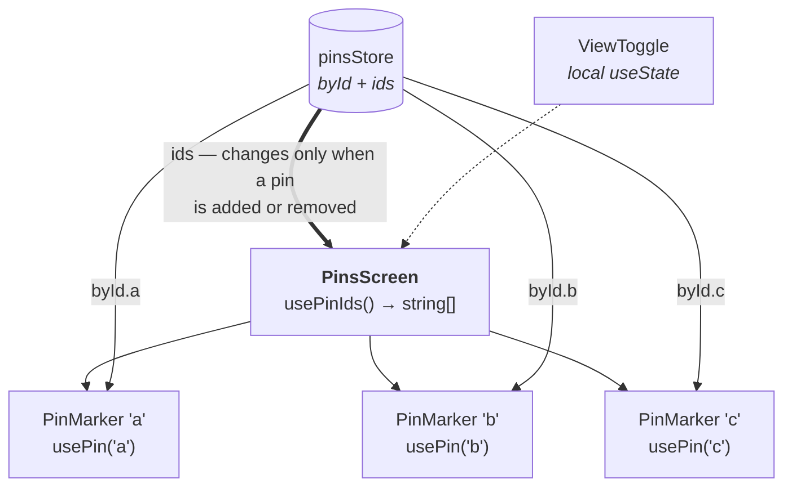

# The Performance Contract

Rules that keep GeoPin fast. Each one exists because of a specific failure this app
would otherwise hit — none are general advice.

> Rule of thumb for the whole document: **a re-render is cheap; a re-render of 50
> map markers is not.** Every rule below is about keeping updates narrow.

---

## The subscription graph

This is the shape to preserve. If a change makes an arrow fan out wider, it's a
regression.



**Screens subscribe to IDs. Leaves subscribe to entities.** The screen re-renders when
the *set* changes; a marker re-renders when *its own* pin changes. Nothing re-renders
both.

---

## The stable-snapshot rule

`useSyncExternalStore` calls your selector on every render and compares the result
with `Object.is`. A selector that builds a new object or array on every call never compares
equal, so React re-renders forever and eventually throws:

> *The result of getSnapshot should be cached to avoid an infinite loop*

```ts
// ✅ stable — same reference until that pin changes
useSelector(store, (s) => s.pins.byId[id]);

// ✅ stable — `ids` is a stored array, replaced only on add/remove
useSelector(store, (s) => s.pins.ids);

// ✅ stable — a primitive
useSelector(store, (s) => s.pins.ids.length);

// ❌ new array every call → infinite loop
useSelector(store, (s) => s.pins.ids.map((i) => s.pins.byId[i]));

// ❌ new object every call → infinite loop
useSelector(store, (s) => ({ pin: s.pins.byId[id], status: s.status }));
```

**Derived collections are computed once inside `setState` and stored**, never derived
in a selector. If you need two values, call `useSelector` twice — two stable
subscriptions beat one unstable one.

---

## Rules

### 1. Never put the map region in state

`onRegionChange` fires continuously while panning. In state that's a re-render per
frame, of the screen and every marker.

```tsx
const regionRef = useRef<Region | null>(null);

<MapView
  onRegionChangeComplete={(region) => { regionRef.current = region; }}
  // ❌ onRegionChange={setRegion}
/>
```

`onRegionChangeComplete` fires once when the gesture settles. Read the ref when you
actually need the value — persisting the last position, or seeding the next launch.

### 2. Markers and rows are `memo`'d and subscribe individually

```tsx
export const PinMarker = memo(({ pinId }: { pinId: string }) => {
  const pin = usePin(pinId);          // subscribes to byId[pinId] only
  if (!pin) return null;
  return <Marker coordinate={pin} title={pin.title} />;
});
```

The component takes a **`pinId`, not a `pin`**. Passing the object would mean the
parent has to read it, which puts the parent back in the subscription path and undoes
ADR-004.

### 3. `memo` compares shallowly — don't hand it fresh objects

One of these defeats memoization completely:

```tsx
<PinMarker style={{ flex: 1 }} />              // ❌ new object every render
<PinList data={pins.filter(p => p.visible)} /> // ❌ new array every render
<PinRow onPress={() => select(id)} />          // ❌ new function every render
```

Hoist styles to `StyleSheet.create`, compute filtered lists in the store, and
`useCallback` handlers — but only where the child is actually memoized. Elsewhere
`useCallback` is noise.

### 4. `renderItem` and `keyExtractor` are stable references

```tsx
const renderItem = useCallback(
  ({ item }: { item: string }) => <PinRow pinId={item} />, []
);
const keyExtractor = useCallback((id: string) => id, []);

<FlatList data={pinIds} renderItem={renderItem} keyExtractor={keyExtractor} />
```

Note `data` is **`string[]` of IDs**, not `Pin[]`. The list re-renders only when the
set changes; each row subscribes to its own pin.

### 5. `getItemLayout` when rows are fixed height

The single biggest FlatList win. Skips measurement entirely and makes
`scrollToIndex` instant — which the map→list "show me this pin" interaction needs.

```tsx
const getItemLayout = (_: unknown, index: number) =>
  ({ length: ROW_HEIGHT, offset: ROW_HEIGHT * index, index });
```

### 6. Images need stable sources and a real cache

```tsx
<Image source={{ uri: pin.imageUrl }} />   // ❌ new object every render → reload flicker
```

Use `expo-image`, which caches by URI and accepts a plain string source. Give every
image explicit dimensions so layout doesn't jump when it loads.

### 7. Screens stay mounted — use `useFocusEffect`

React Navigation keeps screens in the stack. `useEffect(..., [])` runs once on first
mount and never again when the user navigates back. Anything that should refresh on
return uses `useFocusEffect`; anything expensive that should pause when the screen
isn't visible uses `useIsFocused`.

### 8. Context values that change are a bug, not a tradeoff

`StoresContext` and `RepositoriesContext` are built once in `AppProviders` and
memoized. If a Context value in this app ever changes after mount, something has been
misplaced — data belongs in the store.

---

## How to verify, in order

1. **Count renders before optimizing.** `useRenderCount` from
   [patterns/microHooks.ts](../patterns/microHooks.ts) on a marker and a row. Drop a
   pin, edit a pin, pan the map, and read the numbers.
2. **React DevTools Profiler** → "Highlight updates". Panning the map should flash
   nothing. Editing one pin should flash one marker.
3. **Only then** reach for `getItemLayout`, lower `windowSize`, or FlashList.

Measure first. Three of the rules above are free because they're structural — the
subscription shape, ID-based props, the region ref — and those are worth following
from day one precisely because retrofitting them means touching every component.
