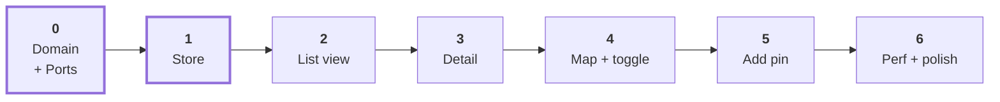

# Implementation Roadmap

Build order chosen so that **every phase is verifiable before the next one starts**,
and so the untestable parts (map, camera, GPS) come last rather than blocking
everything behind a simulator.

Phases 0 and 1 carry the architecture. If they're right, the rest is assembly.

---

## Phase 0 — Domain and ports

No React. No UI. Nothing to run.

- `domain/pin.ts` — `Pin`, `Coordinate`, `PinDraft`, plus pure helpers.
- `domain/note.ts` — `Note`.
- `data/PinRepository.ts`, `data/NoteRepository.ts` — **interfaces only**.
- `data/HttpPinRepository.ts` — uses `fetchJson` from [patterns/fetchJson.ts](../patterns/fetchJson.ts).
- `data/fakes/FakePinRepository.ts` — in-memory, seeded with ~20 pins.

**Done when:** you can `await fakePinRepository.listPins(signal)` in a plain Node
script and get pins back. No simulator involved.

**Why first:** this is the seam everything else hangs off. Getting `AbortSignal` into
every method signature now costs nothing; retrofitting it later touches every layer.

---

## Phase 1 — The store

- `store/createStore.ts` — the ~40-line primitive plus `useSelector`.
- `store/entities.ts` — `EntitySlice<T>`, `upsert`, `removeById`.
- `store/createPinsStore.ts` — factory taking a `PinRepository`.
- `providers/AppProviders.tsx` — the composition root.
- `hooks/usePins.ts` — `usePinIds`, `usePin`, `usePinsStatus`, `usePinActions`.

**Done when:** a test drives `createPinsStore(fakeRepo)` through load → success →
error → retry and asserts the state transitions. Still no UI.

**Watch for:** the stable-snapshot rule. Every selector you write here must return a
stored reference, not a computed one. See
[RERENDERS.md](RERENDERS.md#the-stable-snapshot-rule).

---

## Phase 2 — List view

- `components/PinRow.tsx` — `memo`'d, takes `pinId`, subscribes to its own pin.
- `screens/PinsScreen.tsx` — list mode only for now.
- `AsyncBoundary` + `ErrorBoundary` copied from `patterns/` into `src/`.

**Done when:** pins render from the fake repository, loading and error states both
display, and retry works.

**Checkpoint — verify the subscription shape now, while it's cheap.** Drop
`useRenderCount` into `PinRow` and mutate one pin from a debug button. Exactly one row
should log. If more do, the store or the props are wrong, and fixing it here is a
ten-minute job rather than a refactor.

---

## Phase 3 — Detail screen

- `store/createNotesStore.ts` + `hooks/useNotes.ts`.
- `screens/PinDetailScreen.tsx` — image, title, notes list.
- `ensurePin(id)` fetch-on-miss.
- Route typing for `pinDetail: { pinId: string }`.

**Done when:** navigating from the list works, **and** launching the app directly onto
a detail route with an empty store also works. Test the second one deliberately — it's
the deep-link path from [ADR-006](DECISIONS.md#adr-006-navigation-carries-ids-screens-resolve-them)
and it's the one that silently breaks.

**Add here:** `expo-image` for the pin photo, with explicit dimensions so layout
doesn't jump.

---

## Phase 4 — Map and the toggle

First phase that needs a simulator.

- `components/PinMarker.tsx` — `memo`'d, takes `pinId`.
- `components/PinMapView.tsx` — `MapView`, region in a **ref**.
- `components/ViewToggle.tsx` + `mode` state in `PinsScreen`, persisted with
  `useStoredState`.
- `lazy` + `Suspense` around the map component.
- Reuse `useLocation` from [patterns/useLocation.ts](../patterns/useLocation.ts) for
  the initial centre.

**Done when:** toggling preserves scroll and map position sensibly, and panning the
map logs **zero** marker renders.

**Watch for:** [ADR-009](DECISIONS.md#adr-009-map-region-lives-in-a-ref-not-state).
If you reach for `useState` for the region, stop.

---

## Phase 5 — Add a pin

- `screens/NewPinScreen.tsx` — draft in `useReducer`, local to the screen.
- Long-press on the map → `navigate('newPin', { latitude, longitude })`.
- `createPin` action, pessimistic per
  [ADR-010](DECISIONS.md#adr-010-pin-creation-is-pessimistic-in-v1).

**Done when:** a new pin appears in both views without a refetch, and a failed save
keeps the draft and shows an inline error.

---

## Phase 6 — Performance pass and polish

Now, not earlier. With real data volume.

- `getItemLayout` on the list.
- Profile with "Highlight updates": pan the map (nothing should flash), edit a pin
  (one marker should flash).
- Seed the fake repository with 200+ pins and re-check.
- Swap `FakePinRepository` for `HttpPinRepository` in `AppProviders` — **one line**,
  and if it's more than one line, Phase 0 was wrong.

---

## Post-v1 seams

Each of these has a named place to arrive. None requires a rewrite — that's the
return on the layering.

| Feature | Arrives as | Touches |
|---|---|---|
| Offline reads | `CachingPinRepository` wrapping the HTTP one | `data/` only |
| Optimistic creation | temp ID on insert, swap or `removeById` on settle | one store action |
| Search / filter | derived `ids` computed in `setState` | `store/` + one selector |
| Marker clustering | a component between `PinMapView` and `PinMarker` | `components/` only |
| TanStack Query | replaces `store/`, keeps `hooks/` signatures | `store/`, `hooks/` |
| Suspense for data | follows TanStack Query — revisit [ADR-007](DECISIONS.md#adr-007-suspense-for-code-splitting-only-not-for-data) | `hooks/`, screens |

---

## What to carry over from the existing repo

| Existing | Disposition |
|---|---|
| [context/PinsContext.tsx](../context/PinsContext.tsx) | Replaced by `pinsStore`. Keep it until Phase 2 lands so the app keeps running. |
| [hooks/useAsyncData.ts](../hooks/useAsyncData.ts) | Still right for one-off screen fetches. The store handles shared resources. |
| [hooks/useLocationPermission.ts](../hooks/useLocationPermission.ts) | Superseded by [patterns/useLocation.ts](../patterns/useLocation.ts), which handles the subscription-cleanup trap. |
| [screens/MapScreen.tsx](../screens/MapScreen.tsx) | Becomes `PinsScreen` + `PinMapView`. The `useLayoutEffect` header trick carries over. |
| [screens/PinListScreen.tsx](../screens/PinListScreen.tsx) | Becomes list mode inside `PinsScreen`; rows become `PinRow`. |
| [screens/FetchScreen.tsx](../screens/FetchScreen.tsx), [screens/CharacterLists.tsx](../screens/CharacterLists.tsx) | Interview practice, not app code. Leave them. |
